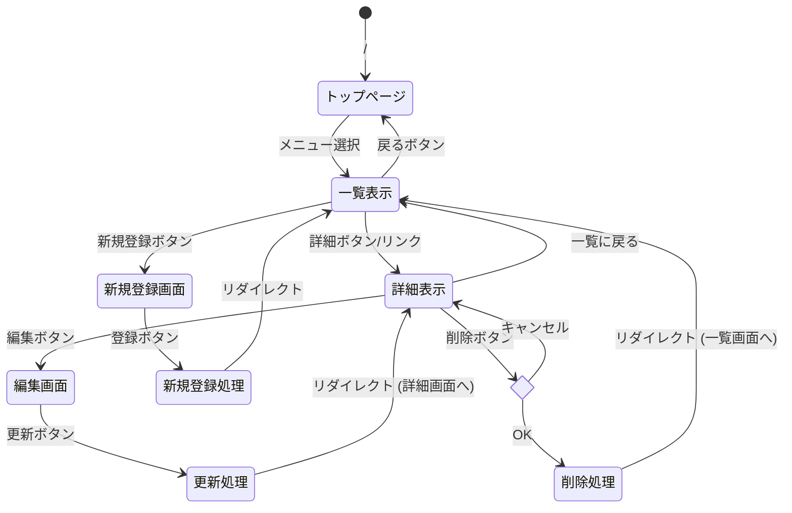

```mermaid
stateDiagram-v2
    [*] --> トップページ: /
    
    state "一覧表示" as List
    state "詳細表示" as Detail
    state "新規登録画面" as Create
    state "編集画面" as Edit
    
    state "新規登録処理" as DoCreate
    state "更新処理" as DoUpdate
    state "削除処理" as DoDelete

    トップページ --> List: メニュー選択

    List --> Detail: 詳細ボタン/リンク
    List --> Create: 新規登録ボタン
    List --> トップページ: 戻るボタン

    Detail --> Edit: 編集ボタン
    Detail --> List: 一覧に戻る
    
    state 削除確認 <<choice>>
    Detail --> 削除確認: 削除ボタン
    削除確認 --> DoDelete: OK
    削除確認 --> Detail: キャンセル

    Create --> DoCreate: 登録ボタン
    DoCreate --> List: リダイレクト

    Edit --> DoUpdate: 更新ボタン
    %% コードでは更新後、詳細画面に戻るように
    DoUpdate --> Detail: リダイレクト (詳細画面へ)
    
    DoDelete --> List: リダイレクト (一覧画面へ)
```
