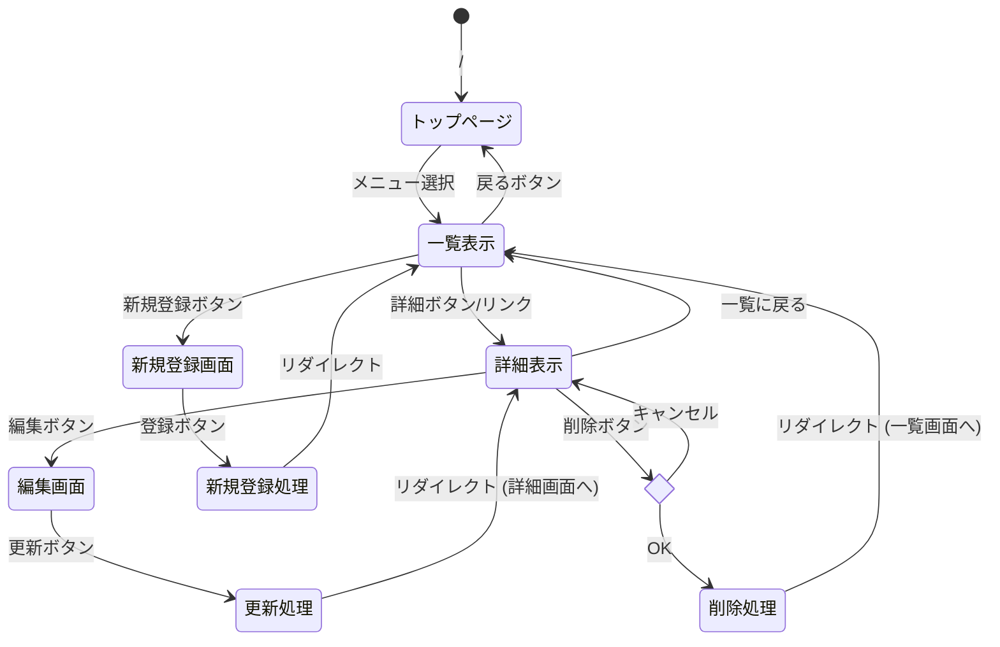

# カルドセプト管理システム 仕様書

## 1. システム概要
ゲーム「カルドセプト」シリーズに関するデータを管理するためのWebアプリケーション群。以下の3つのサブシステムから構成される。

1. **マイ・クリーチャー図鑑**: クリーチャーカードのステータスや使用感を記録する。
2. **マップ攻略メモ**: マップごとの特徴や攻略法を記録する。
3. **歴代作レビュー**: シリーズ作品ごとの評価や感想を記録する。

すべてのシステムは統一された操作体系（一覧、詳細、追加、編集、削除）を持つ。

## 2. データ構造
各データはサーバ上の変数（配列）として管理する。

### データ型の選定理由
* **Integer (整数)**: IDやST、HPなど、計算や大小比較、順序付けに使用する数値項目に使用。
* **String (文字列)**: 名称やメモなどのテキスト情報に使用。なお、`cost`（召喚コスト）については、「60G+地1」のように領地条件が含まれる場合があるため、数値型ではなく文字列型を採用した。

### (1) クリーチャー図鑑 (`creatures`)
| プロパティ名 | 型 | 説明 | 例 |
| :--- | :--- | :--- | :--- |
| `id` | Integer | 管理ID | 1 |
| `name` | String | カード名 | ニンジャ |
| `rarity` | String | レアリティ | N |
| `element` | String | 属性 | 無 |
| `cost` | String | コスト | 70G |
| `st` | Integer | ST (攻撃力) | 40 |
| `hp` | Integer | HP (体力) | 40 |
| `item_limit` | String | アイテム制限 | なし |
| `ability` | String | 特殊能力 | 先制 |
| `memo` | String | メモ | 安い・早い・強い |

### (2) マップ攻略メモ (`maps`)
| プロパティ名 | 型 | 説明 | 例 |
| :--- | :--- | :--- | :--- |
| `id` | Integer | 管理ID | 1 |
| `map_name` | String | マップ名 | アトラ |
| `target_g` | Integer | 目標魔力 | 6000 |
| `structure` | String | 構造の特徴 | 8の字型 |
| `element_trend` | String | 属性傾向 | 全属性 |
| `recommended_card` | String | おすすめカード | デコイ |
| `strategy` | String | 攻略メモ | 属性対策が必須 |

### (3) 歴代作レビュー (`reviews`)
| プロパティ名 | 型 | 説明 | 例 |
| :--- | :--- | :--- | :--- |
| `id` | Integer | 管理ID | 1 |
| `title` | String | 作品名 | カルドセプト セカンド |
| `hardware` | String | ハード | Dreamcast |
| `release_year` | Integer | 発売年 | 2001 |
| `score` | Integer | 点数 | 95 |
| `review_title` | String | タイトル | 最高傑作 |
| `comment` | String | 詳細 | バランスが良い |

## 3. HTTPメソッドとリソース名一覧
3つのシステムでURLパターンを統一する。
※ `[resource]` 部分は `creatures`, `maps`, `reviews` のいずれかが入る。

| 機能 | メソッド | URL | 処理内容 |
| :--- | :--- | :--- | :--- |
| トップメニュー | GET | `/` | 各アプリへのリンクを表示 |
| 一覧表示 | GET | `/[resource]` | データ一覧を表示 |
| 詳細表示 | GET | `/[resource]/detail/:id` | 特定IDの詳細を表示 |
| 新規登録画面 | GET | `/[resource]/create` | 登録フォームを表示 |
| 新規登録処理 | POST | `/[resource]/create` | データを追加して一覧へリダイレクト |
| 編集画面 | GET | `/[resource]/edit/:id` | 編集フォームを表示 |
| 更新処理 | POST | `/[resource]/update/:id` | データを更新して一覧へリダイレクト |
| 削除処理 | POST | `/[resource]/delete/:id` | データを削除して一覧へリダイレクト |

**機能の補足:**
* **削除機能:** 誤操作防止のため、削除ボタン押下時にブラウザの確認ダイアログ（`confirm`）を表示し、「OK」が選択された場合のみPOST送信を実行する。

## 4. ページ遷移図
共通の遷移構造を持つ。

